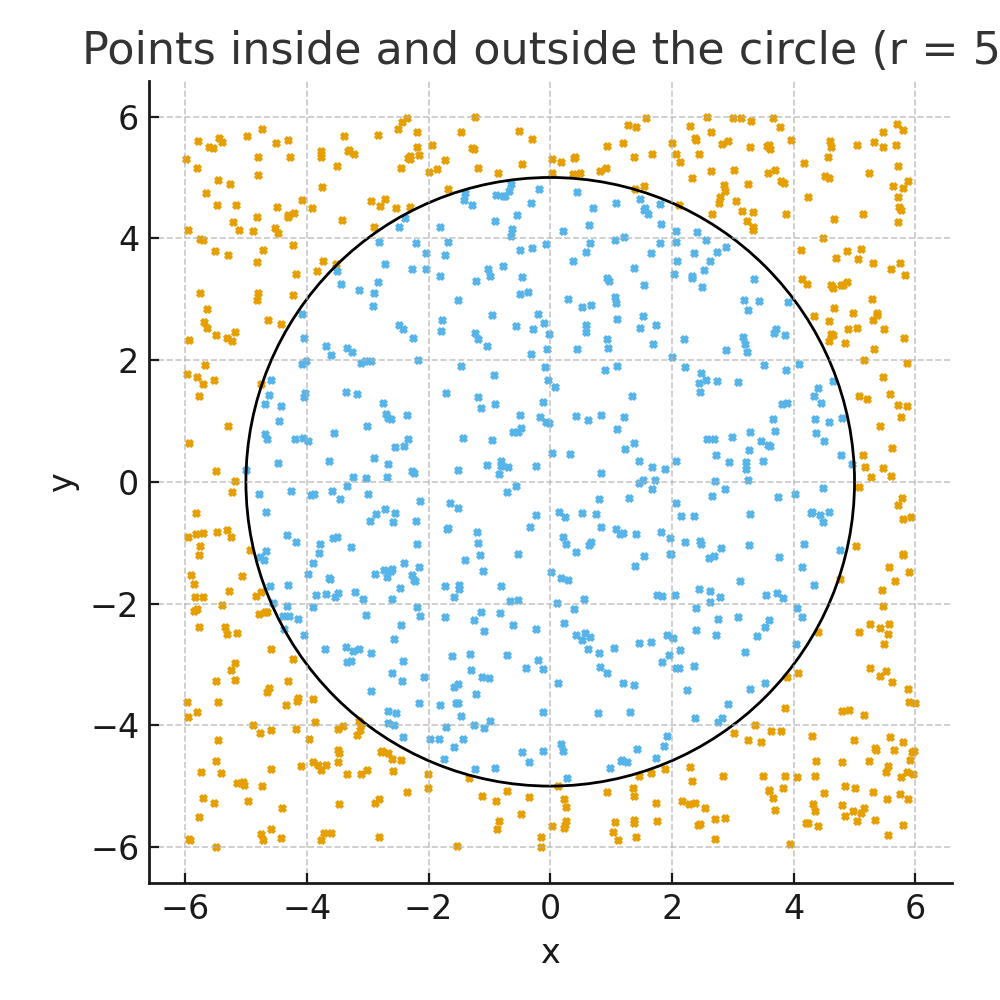

<a target="_blank" href="https://colab.research.google.com/github/Guldana2007/point-inside-circle-nn/blob/main/circle_classifier.ipynb">
  
</a>

You can run this project directly in Google Colab using the button above.

---

# **Point Inside Circle — Neural Network Classifier**

## **1. Introduction**

This project demonstrates a simple neural network that learns to answer one question:

**Is a point (x, y) inside a circle of radius 5 centered at (0, 0)?**

A point belongs to the circle if:

**x² + y² ≤ 25**

We generate a synthetic dataset of random points, train a neural network using TensorFlow/Keras, evaluate accuracy, and provide a helper function that allows checking individual points manually.

The goal is to show how a small feed-forward neural network can learn a simple geometric rule.

---

## **2. Dataset Description**

We generate **20 000 random points** in a square:

- **x ∈ [-6, 6]**
- **y ∈ [-6, 6]**

Each point receives a binary label:

- **1 — inside the circle**
- **0 — outside**

The dataset is then split into:

- **80% training data**
- **20% test data**

This shows how well the model works not only on points it has seen before, but also on brand-new points.

---

## **3. Neural Network Architecture**

The model is a small fully connected network:

- **Input layer:** 2 numbers (x, y)  
- **Hidden layer 1:** 16 neurons, ReLU activation  
- **Hidden layer 2:** 16 neurons, ReLU activation  
- **Output layer:** 1 neuron, Sigmoid activation  

### Why ReLU?

ReLU helps the model learn nonlinear shapes (like circles) effectively.

### Why Sigmoid?

Sigmoid outputs a value between **0 and 1**, which represents the probability that the point is inside the circle.

---

## **4. Data Visualization**

Below is a visualization showing randomly generated points and the circle of radius 5.



This helps understand the geometry of the task.

---

## **5. Training Process**

TensorFlow handles all mathematical steps internally, but the general idea is simple:

1. The model receives (x, y).  
2. It tries to predict whether the point is inside the circle.  
3. The prediction is compared to the correct answer.  
4. The optimizer (`adam`) adjusts the model’s internal weights to reduce the error.  
5. After many training cycles (epochs), the model learns the rule.

We track both:

- **loss** — how far predictions are from correct answers  
- **accuracy** — percentage of correct predictions  

A validation split shows how well the model performs on new, unseen data.

---

## **6. Project Files**

- **circle_classifier.py** — standalone Python script  
- **circle_classifier.ipynb** — Jupyter Notebook with explanations and visualizations  
- **requirements.txt** *(optional)* — list of dependencies  
- **circle_points.png** — visualization image included in the README  

---

## **7. How to Run**

### Install dependencies

```bash
pip install -r requirements.txt
